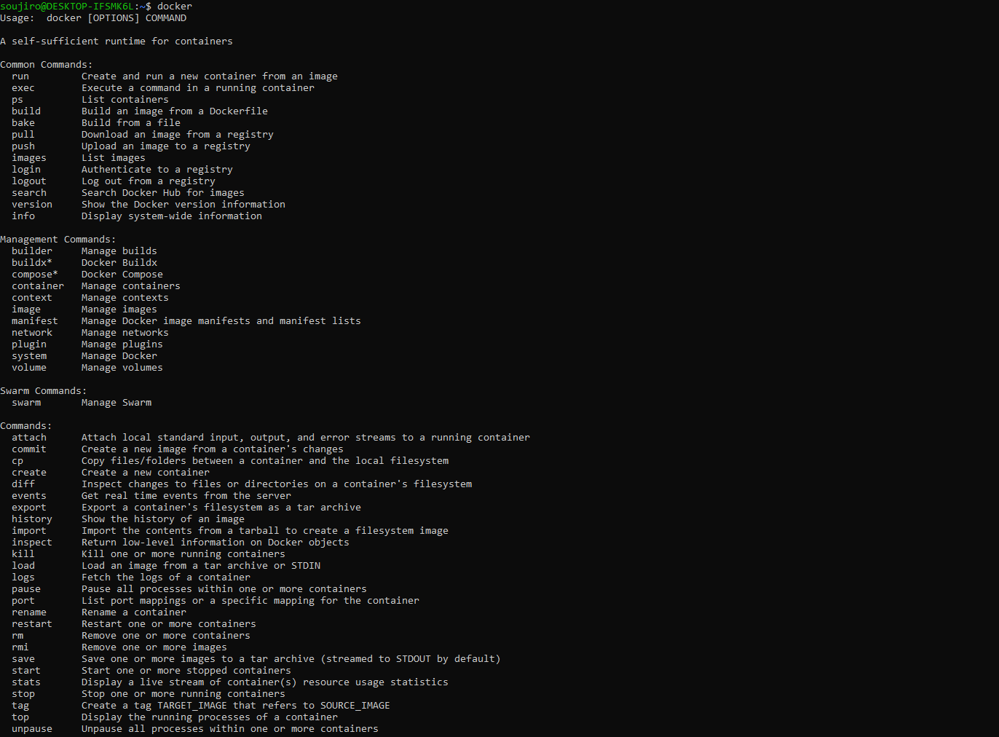
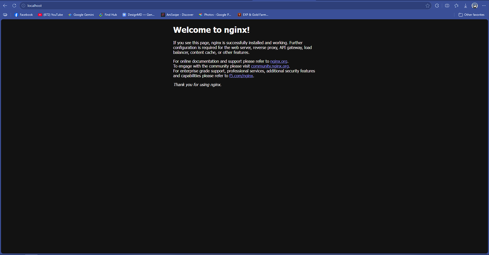
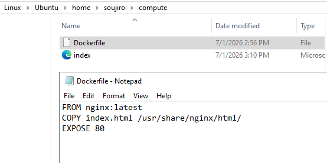
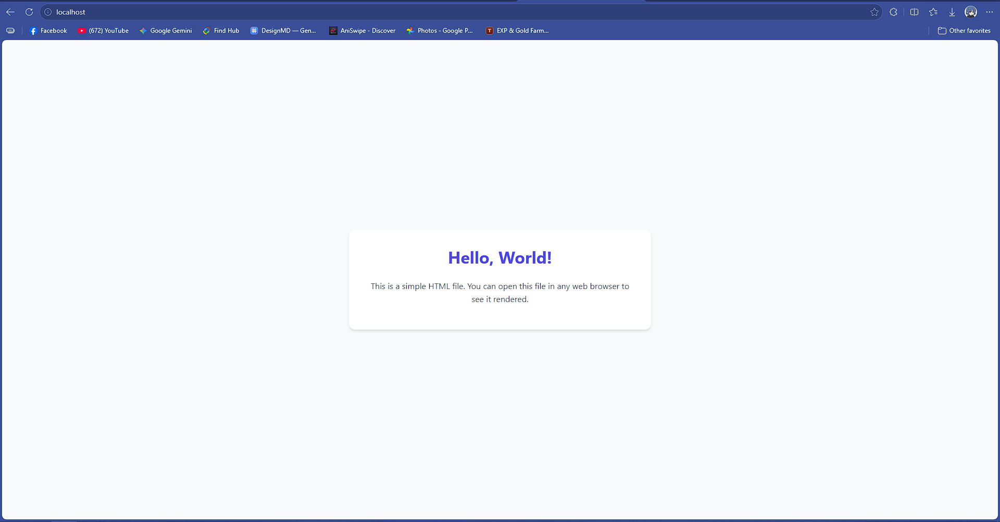
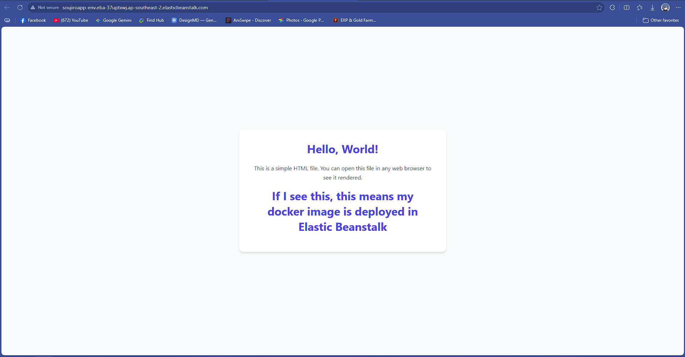
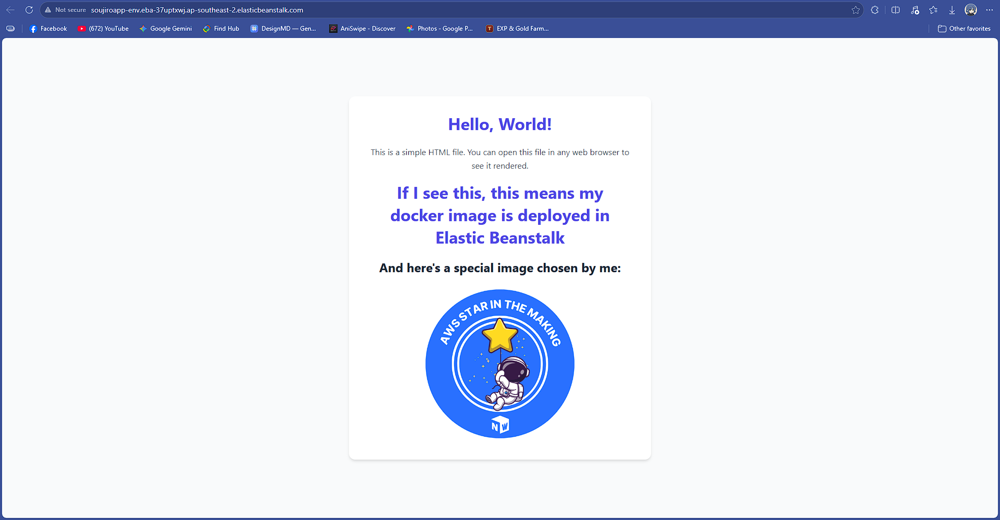

# 🚀 Deploy an App with Docker

<div align="center">


</div>

---

## 📌 Project Information

- **Author:** Jerry Castrudes  
- **Email:** `castrudesjerry11@gmail.com`  
- **Live Project Documentation:** [View NextWork Documentation](https://nextwork.ai/serene_navy_peaceful_jujube/docs/aws-compute-eb)

---

## 📂 Project Assets & Documentation

| Asset Type | Location / Link | Description |
| :--- | :--- | :--- |
| **📄 PDF Lesson** | [lesson.pdf](./lesson.pdf) | Complete exported PDF documentation of the entire walkthough |
| **🖼️ Image Assets** | [images/](./images/) | High-resolution architectural screenshots and deployment captures |
| **💻 Sample Code** | [code/sample_code.zip](./code/sample_code.zip) | Downloadable Docker configuration and application source code |
| **🌐 Live Reference** | [project-link.txt](./project-link.txt) | Direct link to the live documentation and project reference |

---

## 🎯 Introducing Today's Project!

### What is Docker?
Docker is an open-source platform designed to simplify the development, deployment, and management of applications using containerization. Containers are lightweight, portable, and isolated environments that package an application along with its dependencies, ensuring consistent behavior across different systems. I used Docker in this project to demonstrate how to create and deploy a containerized web app.

### One thing I didn't expect...
One thing I didn't expect in this project was that the concepts were very intuitive and straightforward to grasp!

### This project took me...
This project took me approximately **an hour**. The most challenging part was deploying in **AWS Elastic Beanstalk**. It was extremely rewarding to learn how to create a containerized app using Docker and successfully deploy it to the cloud using AWS.

---

## 🏗️ Understanding Containers and Docker

### Containers
Containers are lightweight, portable environments where container images run. They make it effortless to package and deploy applications consistently across multiple devices and cloud providers. A container image serves as the exact instruction blueprint for what to run inside the container.

### Docker & Docker Engine
Docker simplifies managing container lifecycles. **Docker Desktop** provides a user-friendly UI to manage images and containers easily, while the **Docker daemon** runs on the host OS to handle running container instances.

<div align="center">
  
</div>

---

## 🚀 Step-by-Step Implementation

### 1. Running an Nginx Image
Nginx is a popular high-performance web server used to run websites and web applications.

To spin up a fresh Nginx container, I executed:
```bash
docker run -d -p 80:80 nginx
```
- `-d`: Run container in detached mode (background).
- `-p 80:80`: Map internal port `80` of the container to external port `80` on the host machine.
- `nginx`: The official Docker Hub image to run.

<div align="center">
  
</div>

---

### 2. Creating a Custom Image with Dockerfile
A `Dockerfile` is a text file containing explicit instructions for building a custom container image.

```dockerfile
FROM nginx:latest
COPY index.html /usr/share/nginx/html/
EXPOSE 80
```
- `FROM nginx:latest`: Starts our build from the latest official Nginx base image.
- `COPY index.html /usr/share/nginx/html/`: Replaces the default Nginx welcome page with my custom `index.html`.
- `EXPOSE 80`: Declares that the container receives web traffic on port `80`.

To build the custom image from this Dockerfile, I ran:
```bash
docker run -t my-web-app .
```
*(Note: The `.` specifies the current directory as the build context).*

<div align="center">
  
</div>

---

### 3. Running & Testing My Custom Image
When launching my custom container, port 80 was initially occupied by the previous Nginx container. I resolved this by stopping the existing container occupying port 80 and launching my new custom container image.

Once running, the container served my custom web application successfully on localhost!

<div align="center">
  
</div>

---

### 4. Deploying to AWS Elastic Beanstalk
**AWS Elastic Beanstalk** is an orchestration service that handles cloud provisioning, load balancing, scaling, and application health monitoring automatically. You simply build and test your container locally, wrap it into a deployable package, and upload it to Elastic Beanstalk.

Deploying my container image to Elastic Beanstalk took **less than 5 minutes**!

<div align="center">
  
</div>

---

### 5. Deploying App Updates
To demonstrate the continuous deployment flow with Elastic Beanstalk, I modified `index.html` by adding a new heading and updated graphics. After verifying the changes locally in my web browser, I packaged the updated files and deployed a new application version directly through the Elastic Beanstalk console.

<div align="center">
  
</div>

---

## 💡 Key Takeaways
- **Containerization vs. Virtualization:** Containers package dependencies cleanly without the overhead of full virtual machines.
- **Dockerfile Automation:** Infrastructure-as-Code principles apply directly to container builds via simple readable Dockerfiles.
- **Painless Cloud Scaling:** AWS Elastic Beanstalk takes the complexity out of hosting containerized applications on AWS.
